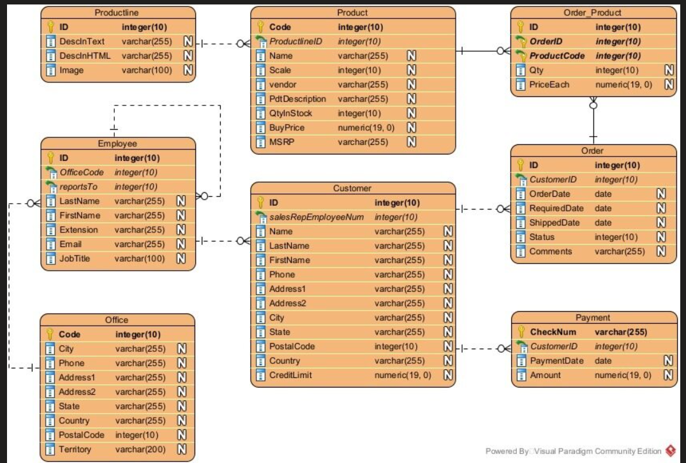

# Sales Management System

A desktop sales management application built using .NET 9, Windows Forms, and Entity Framework Core.

The system demonstrates a complete sales workflow including customer management, product inventory, orders, payments, and employee relationships using a relational SQL database.

## Technologies Used

- .NET 9
- Windows Forms
- Entity Framework Core
- SQL Server
- LINQ
- EF Core Migrations

## Features

- Customer management
- Product and product line management
- Order processing
- Payment tracking
- Employee and office relationships
- Database-first relational design
- CRUD operations for core entities

## Database Design

The project uses a relational database structure with entities such as:

- Customers
- Orders
- Products
- Payments
- Employees
- Offices

### ERD Diagram



## Getting Started

### Requirements

- .NET 9 SDK
- SQL Server
- Visual Studio 2022 or later

### Setup

```bash
git clone https://github.com/salahay2003/SalesManagementSystem.git
cd SalesManagementSystem
```

Update your database connection string inside:

```json
appsettings.json
```

Run migrations:

```bash
dotnet ef database update
```

Run the application:

```bash
dotnet run
```

## Project Purpose

This project was built for learning and practicing:

- Entity Framework Core
- Relational database design
- Desktop application development
- CRUD architecture in .NET
